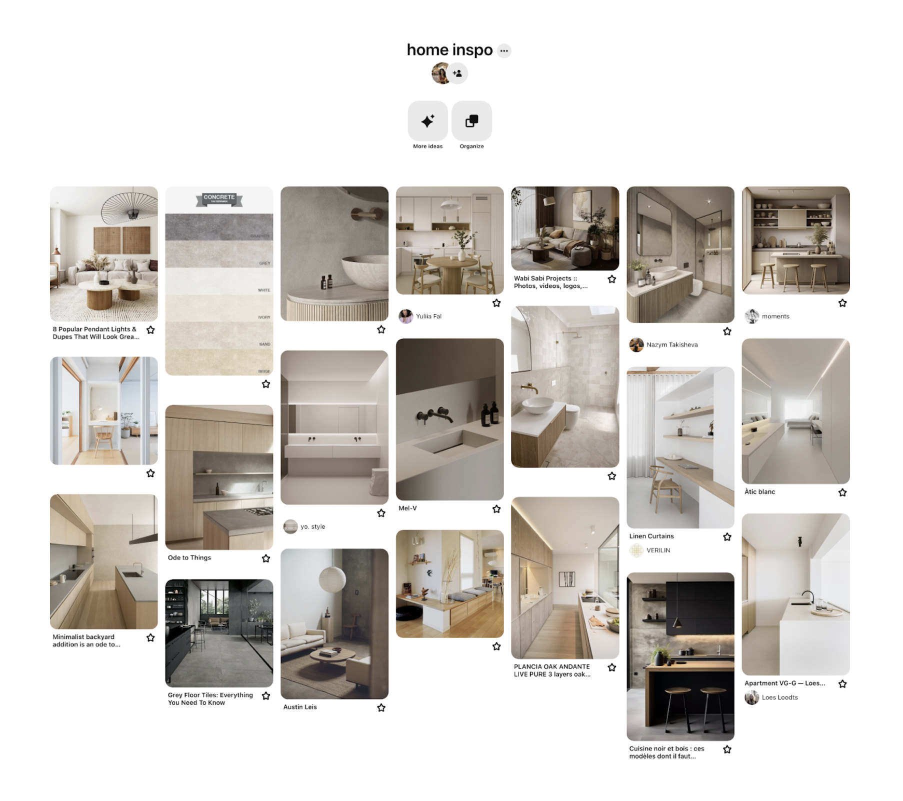

July 11, 2024

# An Interesting Pinterest Case Study

*(The following is loosely adapted from a talk I gave at VentureBeat: Transform 2024.)*

One of the thorniest problems we encountered at Pinterest was a gap between language and taste. People often know what they like when they see it, but can't quite put the right words to it. Someone might have a board full of concrete, warm minimalism, but when asked to search for it, they just type something broad like "living room".

## The Problem

Consider a user with a home decor board that has a clear visual theme - clean lines, natural materials, exposed textures. They know they like it, but they don't know the terms (like "Japandi" or "industrial modern") to describe it.

Without the words, they can't articulate what they're looking for, and they can't search for more of it.

It was winter 2023 and GPT-3.5 had come out a few months prior (we were still pre GPT-4). I started wondering whether we could bridge this by combining Pinterest's visual search and taste graph with LLMs to generate these descriptors automatically, essentially giving users a language for their own aesthetic. I formed a small tiger team to explore the idea.

## Prompt to Product

Our early prompting and prototype loop looked something like this:

1.  **Sanity check**: We asked an LLM to act as an interior designer and summarize a list of Pins. The first attempts were unexpectedly good and yielded not just formulaic keywords but rather a real sense of the underlying vibe.
2.  **Guardrails**: We iterated on the early prompt several times, adding guardrails and a defined JSON schema so we could work with the output programmatically.
3.  **Prototype**: We wrapped the JSON outputs in a lightweight UI and tested the flow on real user boards in a live sandbox environment.

This loop allowed us to test and pivot the idea repeatedly in a matter of days, rather than weeks. (The final production buildout took approximately two additional months.)

## Product and Research

Not only did this allow us to unlock unprecedented product development speed; we were also able to pilot a new operating model between product and research. We ran two parallel tracks:

1.  **Product**: Bootstrap with commercial LLMs to test and validate the user problem quickly.
2.  **Research**: In parallel, invest in longer-horizon modeling innovations – in our case, <a href="https://www.pinterestcareers.com/media/eoqd5wcs/pinclip.pdf" target="_blank" rel="noopener noreferrer">PinCLIP</a> (a CLIP-style model trained on Pinterest data), <a href="https://medium.com/pinterest-engineering/building-pinterest-canvas-a-text-to-image-foundation-model-aa34965e84d9" target="_blank" rel="noopener noreferrer">Pinterest Canvas</a> (a text-to-image foundation model), and embedding work.

Running these tracks in tandem let us to ship value and gather user data *while* deeper research was underway. The product scaffolding gave us a place to plug in new models as they matured, and the user data in turn shaped the research roadmap. It became a single loop rather than two disconnected efforts.

## Et voilà!

<video autoplay loop muted playsinline style="max-width: 300px; width: 30%; border-radius: 4px; float: left; margin: 0 24px 24px 0;">
  <source src="../assets/style-insights-demo.mp4" type="video/mp4">
  Your browser does not support the video tag.
</video>

The final experience was an immersive, personalized style-insights page for every user. It quickly became a top-performing notification. But for me, the lasting takeaway was the working model: product and research moving at different speeds but along a shared loop. It’s an operating pattern I’ve continued to use for early-stage AI product discovery.

